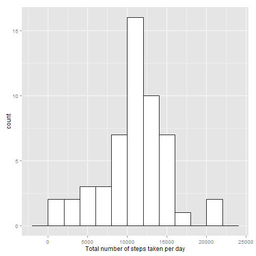
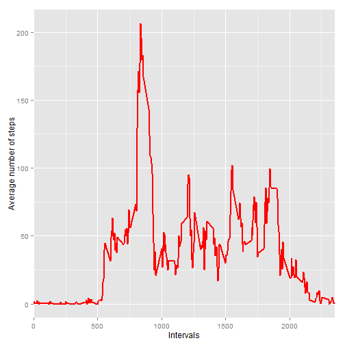
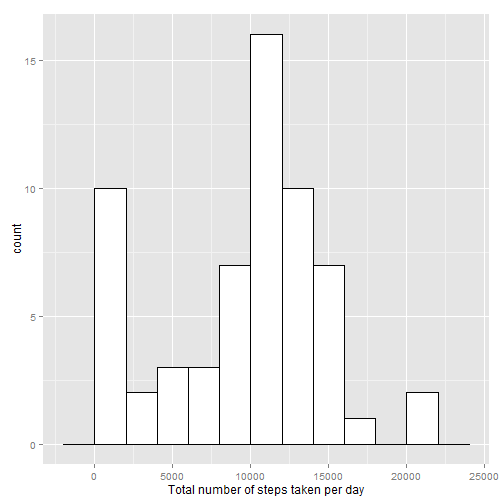
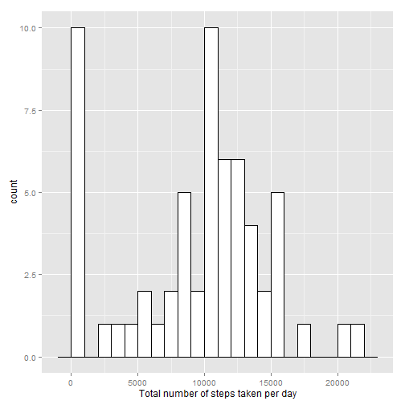
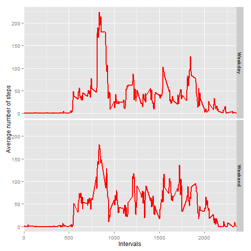

### 1.- Loading and preprocessing the data

We will now list the sequence of steps that are required to load and pre-process the data. 

#### 1.1  Load the data (i.e. *read.csv()*)

The file "activity.csv" is read and stored in a data frame named "theData"


```r
theData <- read.csv("activity.csv")
```


#### 1.2  Process/transform the data (if necessary) into a format suitable for your analysis

The data is already in a suitable format for the analysis that will be performed. Let's take a look 
at what we have. First let's see a summary of the data 


```r
str(theData)
```

```
## 'data.frame':	17568 obs. of  3 variables:
##  $ steps   : int  NA NA NA NA NA NA NA NA NA NA ...
##  $ date    : Factor w/ 61 levels "2012-10-01","2012-10-02",..: 1 1 1 1 1 1 1 1 1 1 ...
##  $ interval: int  0 5 10 15 20 25 30 35 40 45 ...
```

This looks consistent: "date" is a factor with 61 levels: we know that there's data corresponding to 31 days in October plus
30 days in November, hence 61 days in total. Since readings are taken every 5 minutes, we have 12 readings per hour, 288 readings per day, and 17658 readings in a 61-day period. Everything checks so far.

Let's examine the top and tail of the data frame...


```r
head(theData)
```

```
##   steps       date interval
## 1    NA 2012-10-01        0
## 2    NA 2012-10-01        5
## 3    NA 2012-10-01       10
## 4    NA 2012-10-01       15
## 5    NA 2012-10-01       20
## 6    NA 2012-10-01       25
```


```r
tail(theData)
```

```
##       steps       date interval
## 17563    NA 2012-11-30     2330
## 17564    NA 2012-11-30     2335
## 17565    NA 2012-11-30     2340
## 17566    NA 2012-11-30     2345
## 17567    NA 2012-11-30     2350
## 17568    NA 2012-11-30     2355
```
    
There seem to be quite a few NAs; besides, we notice that "interval"" is expressed in an integer time format of the 
form HHMM, where HH stands for hour (in military format) and HH for minutes (expressed in 5-minute intervals)
    
     
## 2.- What is the mean total number of steps taken per day?


#### 2.1  Make a histogram of the total number of steps taken each day

We will now generate a histogram of the total number of steps taken per day. First we
aggregate number of steps by date by adding them; NAs are ignored by default.


```r
total1 <- aggregate(theData$steps, by = list(date = theData$date), sum)
```
We invoke the ggplot library


```r
library(ggplot2)
```
and generate the histogram for a bin width of 2000 steps.


```r
g <- ggplot(total1, aes(x)) + 
    geom_histogram(binwidth=2000, colour="black", fill="white") + 
    xlab("Total number of steps taken per day") 

print(g)    
```

 

#### 2.2  Calculate and report the **mean** and **median** total number of steps taken per day
    
The mean of the total number of steps taken per day is


```r
mean(total1$x, na.rm = TRUE)
```

```
## [1] 10766.19
```
   
And the median of the total number of steps taken per day is


```r
median(total1$x, na.rm = TRUE)
```

```
## [1] 10765
```
  
**NAs are ignored** in the computation of the mean and the median.
   
## 3.- What is the average daily activity pattern?

#### 3.1  Make a time series plot (i.e. *type = "l"*) of the 5-minute interval (x-axis) and the average number of steps taken, averaged across all days (y-axis)

We will now build a time series plot of the average number of steps taken in each 5-minute interval,
averaged across all days. First we wil aggregate data frame "theData" using field "interval"
by computing the mean for the same intervals across all days. NAs are ignored in the computation of the mean.


```r
total2 <- aggregate(theData$steps, by = list(interval = theData$interval), mean, na.rm = TRUE)
```

We generate the requested plot


```r
g <- ggplot(total2, aes(interval, x)) + 
    geom_line(colour="red", size=1) + 
    xlab("Intervals") + 
    ylab("Average number of steps") +
    coord_cartesian(xlim = c(0, 2355)) 

print(g)   
```

 

#### 3.2  Which 5-minute interval, on average across all the days in the dataset, contains the maximum number of steps?

Here we determine which 5-minute interval contains the maximum average number of steps.  


```r
total2$interval[which(total2$x == max(total2$x))]
```

```
## [1] 835
```
The maximum average number of steps is taken in the 08:30 to 08:35 interval.

## 4.- Imputing missing values

#### 4.1  Calculate and report the total number of missing values in the dataset (i.e. the total number of rows with NAs)

The presence of missing values will affect some calculations and/or summaries of the data. We will now find out how many observations contain NAs:


```r
sum(is.na(theData$steps))
```

```
## [1] 2304
```
2304 NAs out of 17568 observations: we are dealing with a data frame in which roughly 13% of the observations are missing.

#### 4.2  Devise a strategy for filling in all of the missing values in the dataset. The strategy does not need to be sophisticated. For example, you could use the mean/median for that day, or the mean for that 5-minute interval, etc.

We need to come up with a strategy to replace those NAs with numbers that will make sense in the context of the data. We will 
do this by using the function *na.approx* from package "zoo" to replace NAs with linearly interpolated values
    
We first invoke library "zoo"


```r
library(zoo)
```
   
Now let's create a vector containing a copy of variable "steps" with the NAs replaced by the interpolation. *rule = 2* means that leading NAs in the vector will be replaced by zeroes (since there are no previous values that can be used by the 
interpolation procedure)


```r
stepsFixed <- na.approx(theData$steps, na.rm = FALSE, rule = 2)
```

#### 4.3  Create a new dataset that is equal to the original dataset but with the missing data filled in.

We will now create a new data frame in which NAs in "steps" will be replaced by interpolated values. 


```r
theDataFixed <- theData
theDataFixed$steps <- stepsFixed
```

#### 4.4  Make a histogram of the total number of steps taken each day and calculate and report the mean and median total number of steps taken per day. Do these values differ from the estimates from the first part of the assignment? What is the impact of imputing missing data on the estimates of the total daily number of steps?

We now generate a histogram of the total number of steps taken per day using this new data frame. We first
aggregate number of steps by date.


```r
total12 <- aggregate(theDataFixed$steps, by = list(date = theData$date), sum)
```

and generate the histogram for a bin width of 2000 steps.


```r
g <- ggplot(total12, aes(x)) + 
    geom_histogram(binwidth=2000, colour="black", fill="white") + 
    xlab("Total number of steps taken per day") 

print(g)    
```

 
    
The mean of the total number of steps taken per day is


```r
mean(total12$x, na.rm = TRUE)
```

```
## [1] 9354.23
```
   
And the median of the total number of steps taken per day is


```r
median(total12$x, na.rm = TRUE)
```

```
## [1] 10395
```

Both the histogram as well as the median and mean are significantly different now: the interpolation procedure
mostly replaced NAs with zeroes. This is evident from the leftmost column in the previous histogram and from the following histogram calculated for a bin width of 1000 steps.


```r
g <- ggplot(total12, aes(x)) + 
    geom_histogram(binwidth=1000, colour="black", fill="white") + 
    xlab("Total number of steps taken per day") 

print(g)    
```

 

## 5.- Are there any differences in activity patterns between weekdays and weekends?

#### 5.1  Create a new factor variable in the dataset with two levels - "weekday" and "weekend" indicating whether a given date is a weekday or weekend day.

First we define a function to perform a classification of days into "weekdays" or "weekends":


```r
ClassifyDay <- function(date){
theDay <- weekdays(as.Date(date))
if(theDay == "Monday" || theDay == "Tuesday" || theDay == "Wednedsday" || theDay == "Thursday" || theDay == "Friday"){
    class = "Weekday"
} else {
    class = "Weekend"
}
return(class)
}
```
We now use this function to add a new factor "Day" with two levels ("weekend" and "weekday") to the original data frame


```r
theData$Day <- sapply(theData$date, ClassifyDay)
theData <- transform(theData, Day = factor(Day))
```

#### 5.2 Make a panel plot containing a time series plot (i.e. type = "l") of the 5-minute interval (x-axis) and the average number of steps taken, averaged across all weekday days or weekend days (y-axis). See the README file in the GitHub repository to see an example of what this plot should look like using simulated data.

Now we aggregate the variable "steps", grouped by the fields "interval" and "Day" whilst taking the mean for the same 5-minute intervals across all days. NAs are ignored in the computation of the mean.


```r
total21 <- aggregate(theData$steps, by = list(interval = theData$interval, Day = theData$Day), mean, na.rm = TRUE)
```
A plot of the time series for the mean number of steps taken in each 5-minute interval, discriminated by week days and
weekend days is shown below


```r
g <- ggplot(total21, aes(interval, x)) + 
    geom_line(colour="red", size = 1) + 
    facet_grid(Day ~ .) +
    xlab("Intervals") + 
    ylab("Average number of steps") +
    coord_cartesian(xlim = c(0, 2355)) 

print(g)  
```

 

The patterns for both weekdays and weekends seem similar; however the maximum number of steps is slightly smaller during weekends. 

